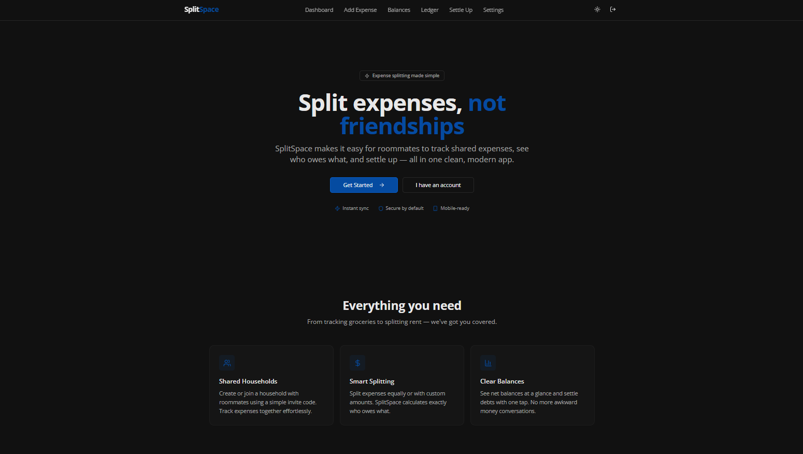
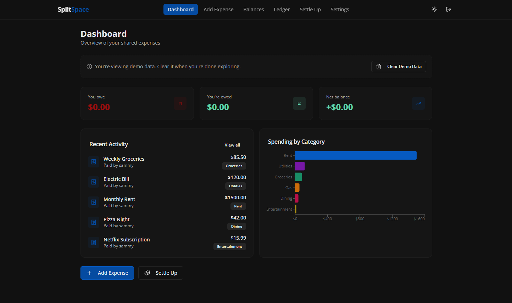

# SplitSpace

A full stack web application for splitting expenses among roommates. Create or join households, track shared expenses, view balances, and settle debts all in one clean, modern app.

---

## Screenshots

## Landing Page


---

## Dashboard


---

## Features

- **Household management** with invite codes for easy roommate onboarding
- **Expense tracking** with equal or custom splits across categories
- **Balance dashboard** showing who owes whom at a glance
- **Transaction ledger** with date and category filtering
- **Settlement recording** to zero out balances between roommates
- **Spending charts** with category breakdowns
- **Demo mode** to try the app with sample data
- **Dark/light mode** with system preference detection
- **Mobile friendly** responsive design
- **Username system** set on signup, editable in settings

---

## Session Support

- **Households** — Create, join, switch between, or delete households
- **Expenses** — Add with description, amount, category, date, payer, and split method
- **Settlements** — Record payments between members with optional notes
- **Ledger** — Filter by date range, category, or member

---

## Technologies Used

- **TypeScript** for frontend and backend
- **React 18** with Vite for the frontend
- **Express** (Node.js) for the backend API
- **Supabase** for authentication and PostgreSQL database
- **Tailwind CSS** with shadcn/ui components for styling
- **Recharts** for spending visualizations
- **TanStack React Query** for data fetching
- **Wouter** for client side routing

---

## How to Run

Clone the repo:
```bash
git clone https://github.com/SammyBolger/splitspace.git
cd splitspace
```

Install dependencies:
```bash
npm install
```

Set up Supabase:
1. Create a project at [supabase.com](https://supabase.com)
2. Run `supabase-schema.sql` in the Supabase SQL Editor to create tables and RLS policies
3. Run `supabase-fix.sql` if needed for additional fixes

Create a `.env` file from the example:
```bash
cp .env.example .env
```

Fill in your Supabase credentials (found in Settings > API in your Supabase dashboard).

Run the development server:
```bash
npm run dev
```

Open [http://localhost:5000](http://localhost:5000)

---

## Building for Production

```bash
npm run build
npm start
```

---

## Environment Variables

| Variable | Description |
|---|---|
| `SUPABASE_URL` | Supabase project URL |
| `SUPABASE_ANON_KEY` | Supabase anonymous API key |
| `SUPABASE_SERVICE_ROLE_KEY` | Supabase service role key (server side operations) |
| `DATABASE_URL` | PostgreSQL connection string (for Drizzle migrations) |
| `SESSION_SECRET` | Express session secret |

---

## Future Work

- **Push notifications** for new expenses and settlement reminders
- **Recurring expenses** for rent, subscriptions, and utilities
- **Export ledger** to CSV or PDF
- **Multi currency support** for international households
- **Expense attachments** for receipts and photos

---

## Data

All user data is stored in a [Supabase](https://supabase.com) PostgreSQL database with Row Level Security policies for data protection.

---

## Contact

- **LinkedIn:** [Sam Bolger](https://www.linkedin.com/in/sambolger/)
- **Email:** sbolger@cord.edu
- **Portfolio:** [sammybolger.com](http://www.sammybolger.com/)
